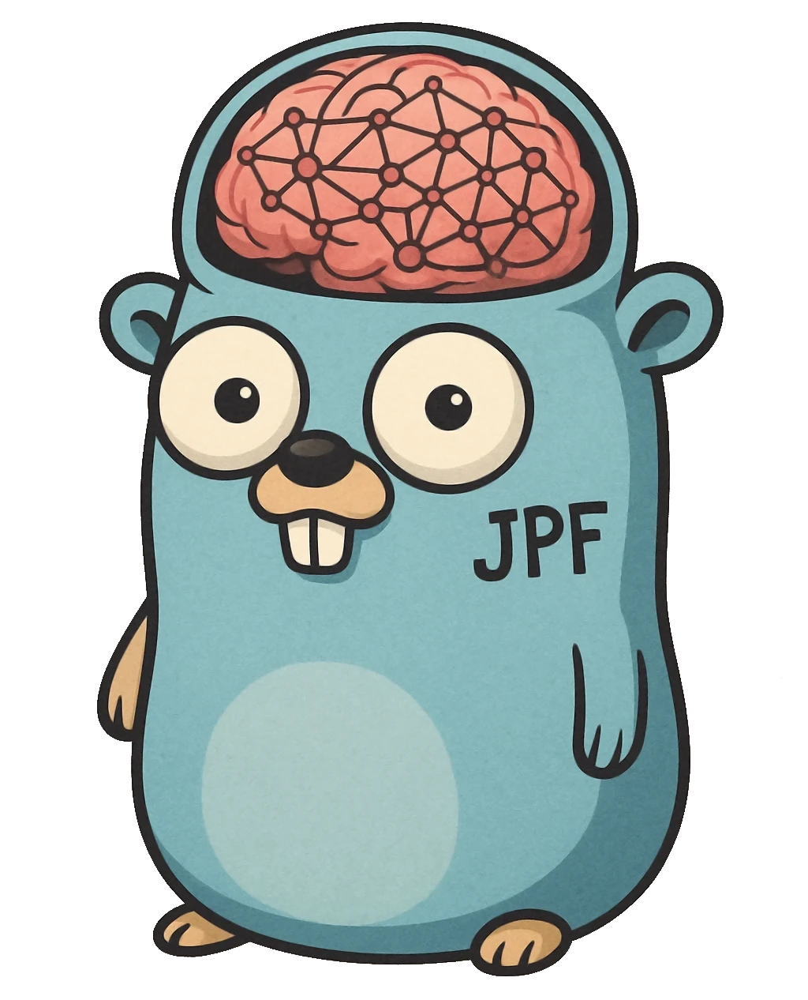

[](https://goreportcard.com/report/github.com/JoshPattman/jpf)
[](https://pkg.go.dev/github.com/JoshPattman/jpf)
[](https://opensource.org/licenses/MIT)

<p align="center">
  
</p>

# `jpf` - A Lightweight Framework for AI-Powered Applications

jpf is a Go library for building lightweight AI-powered applications. It provides essential building blocks and robust LLM interaction interfaces, enabling you to craft custom solutions without the bloat.

jpf is aimed at using AI as a tool - not as a chatbot (this is not to say you cannot use it to make a chatbot, however there is no framework provided for this yet). It focusses on adding AI features locally, as opposed to relying too heavily on external APIs - this makes the package particularly flexible when switching models or providers.

## Table of Contents

- [Table of Contents](#table-of-contents)
- [Features](#features)
- [Installation](#installation)
- [License](#license)
- [Contributing](#contributing)
- [FAQ](#faq)
- [Author](#author)
- [Core Concepts](#core-concepts)

## Features

- **Retry and Feedback Handling**: Resilient mechanisms for retrying tasks and incorporating feedback into interactions.
- **Customizable Models**: Seamlessly integrate LLMs, including reasoning chains and hybrid models.
- **Token Usage Tracking**: Stay informed of API token consumption for cost-effective development.
- **Easy-to-use Caching**: Reduce the calls made to models by composing a caching layer onto an existing model.
- **Out-of-the-box Logging**: Simply add logging messages to your models, helping you track down issues.
- **Industry Standard Context Management**: All potentially slow interfaces support Go's context.Context for timeouts and cancellation.

## Installation

Install jpf in your Go project via:

```bash
go get github.com/JoshPattman/jpf
```

## License

This project is licensed under the MIT License. See the [LICENSE](./LICENSE) file for details.

## Contributing

Contributions are welcome! Open an issue or submit a pull request on GitHub.

## FAQ
- Will streaming (token-by-token) ever be supported?
    - No. This framework is designed to be more of a back-end tool, and character streaming would add extra complexity that most applications of this package would not benefit from (in my opinion).
- Are there any pre-built formatters / parsers?
    - There are a few built in implementations, however the aim of this package is to create the framework, not the functionality.
    - If you have any ideas of useful functions, feel free to put them on an issue, and if enough arise, I can make a new repo for these.
- Where are the agents?
    - This package is tries to simplify single calls to LLMs, which is a level below what agents do.
    - I have plans to build an agent framework on top of this package, but I would like to build a strong foundation first.
- Why does this not support MCP tools on the OpenAI API / Tool calling / Other advanced API feature?
    - The aim of this package is to put the advanced stuff, like using tools, to you to figure out. IMO this allows you to do cooler, more flexible things (like a tree of agents).
    - Also, to a degree tool calls / MCP tools lock you in to one API or another, more than just using the chat completions endpoint.
    - I might consider adding them in the future, but for now I think that implementing your own tool calling is best.
    - As a rule of thumb, I will add API features that fiddle with the log probs (e.g. structured output, temperature, top p, ...) but I will not add something if a model could not achieve the same result with perfect prompting.
- I want to change my models temperature/structured output/output tokens/... after I have built it!
    - The intention is to provide functions that need to use an LLM with a builder function instead of a built object. This way, you can use the builder function multiple times with different parameters.
    - IMO, a model only exposing its respond function is cleanest and simplest.

## Author

Developed by Josh Pattman. Learn more at [GitHub](https://github.com/JoshPattman/jpf).

## Core Concepts

- jpf aims to separate the various components of building a robust interaction with an LLM for three main reasons:
  - **Reusability**: Build up a set of components you find useful, and write less repeated code.
  - **Flexibility**: Write code in a way that easily allows you to extend the LLM's capabilities - for example you can add cache to an LLM without changing a single line of business logic.
  - **Testability**: Each component being an atomic piece of logic allows you to unit test and mock each and every piece of logic in isolation.
- Below are the core components you will need to understand to write code with jpf:

<details>
<summary>Model</summary>

- `Model`s are the core component of jpf - they wrap an LLM with some additional logic in a consistent interface.
```go
// Model defines an interface to an LLM.
type Model interface {
	// Responds to a set of input messages.
	Respond(ctx context.Context, messages []Message) (ModelResponse, error)
}

type ModelResponse struct {
	// Extra messages that are not the final response,
	// but were used to build up the final response.
	// For example, reasoning messages.
	AuxiliaryMessages []Message
	// The primary response to the users query.
	// Usually the only response that matters.
	PrimaryMessage Message
	// The usage of making this call.
	// This may be the sum of multiple LLM calls.
	Usage Usage
}

// Message defines a text message to/from an LLM.
type Message struct {
	Role    Role
	Content string
	Images  []ImageAttachment
}
```
- Models are built using composition - you can produce a very powerful model by stacking up multiple less powerful models together.
  - The power with this approach is you can abstract away a lot of the complexity from your client code, allowing it to focus primarily on business logic.

```go
// All model constructors in jpf return the Model interface,
// we can re-use our variable as we build it up.
var model jpf.Model

// Switch, based on a boolean variable, if we should use Gemini or OpenAI.
// If using Gemini, we will scale the temperature down a bit (NOT useful - just for demonstration).
if useGemini {
    model = jpf.NewGeminiModel(apiKey, modelName, jpf.WithTemperature{X: temperature*0.8})
} else {
    model = jpf.NewOpenAIModel(apiKey, modelName, jpf.WithTemperature{X: temperature})
}

// Add retrying on API fails to the model.
// This will retry calling the child model multiple times upon an error.
if retries > 0 {
    model = jpf.NewRetryModel(model, retries, jpf.WithDelay{X: time.Second})
}

// Add cache to the model.
// This will skip calling out to the model if the same messages are requested a second time.
if cache != nil {
    model = jpf.NewCachedModel(model, cache)
}

// We now have a model that may/may not be gemini / openai, with retrying and cache.
// However, the client code does not need to know about any of this - to it we are still just calling a model!
```

</details>

<details>
<summary>Message Encoder</summary>

- A `MessageEncoder` provides an interface to take a specific typed object and produce some messages for the LLM.
  - It does not actually make a call to the `Model`, and it does not decode the response.

```go
// MessageEncoder encodes a structured piece of data into a set of messages for an LLM.
type MessageEncoder[T any] interface {
	BuildInputMessages(T) ([]Message, error)
}
```

- For more complex tasks, you may choose to implement this yourself, however there are some useful encoders built in (or use a combination of both built-in and custom):
  
```go
// NewRawStringMessageEncoder creates a MessageEncoder that encodes a system prompt and user input as raw string messages.
func NewRawStringMessageEncoder(systemPrompt string) MessageEncoder[string] {...}

// NewTemplateMessageEncoder creates a MessageEncoder that uses Go's text/template for formatting messages.
// It accepts templates for both system and user messages, allowing dynamic content insertion.
func NewTemplateMessageEncoder[T any](systemTemplate, userTemplate string) MessageEncoder[T] {...}

// Create a new message encoder that appends the results of running each message encoder sequentially.
// Useful, for example, to have a templating system / user message encoder, and a custom agent history message encoder after.
func NewSequentialMessageEncoder[T any](msgEncs ...MessageEncoder[T]) MessageEncoder[T] {...}
```

</details>

<details>
<summary>Response Decoder</summary>

- A `ResponseDecoder` parses the output of an LLM into structured data.
- As with message encoders, they do not make any LLM calls.
- The decoder receives both the input data (type `T`) and the LLM response, allowing it to validate or parse the response in context of the original input.
```go
// ResponseDecoder converts an input to an LLM and the LLM response into a structured piece of output data.
// When the LLM response is invalid, it should return ErrInvalidResponse (or an error joined on that).
type ResponseDecoder[T, U any] interface {
	ParseResponseText(T, string) (U, error)
}
```
- You may choose to implement your own response decoder, however in my experience a json object is usually sufficient output.
- When an error in response format is detected, the response decoder must return an error that, at some point in its chain, is an `ErrInvalidResponse` (this will be explained in the Map Func section).
- There are some pre-defined response decoders included with jpf:
```go
// NewRawStringResponseDecoder creates a ResponseDecoder that returns the response as a raw string without modification.
// The type parameter T represents the input type that will be passed through (but ignored by this decoder).
func NewRawStringResponseDecoder[T any]() ResponseDecoder[T, string] {...}

// NewJsonResponseDecoder creates a ResponseDecoder that tries to parse a json object from the response.
// It can ONLY parse json objects with an OBJECT as top level (i.e. it cannot parse a list directly).
// The type parameter T represents the input type, and U represents the output type.
func NewJsonResponseDecoder[T, U any]() ResponseDecoder[T, U] {...}

// Wrap an existing response decoder with one that takes only the part of interest of the response into account.
// The part of interest is determined by the substring function.
// If an error is detected when getting the substring, ErrInvalidResponse is raised.
func NewSubstringResponseDecoder[T, U any](decoder ResponseDecoder[T, U], substring func(string) (string, error)) ResponseDecoder[T, U] {...}

// Creates a response decoder that wraps the provided one,
// but then performs an extra validation step on the parsed response.
// If an error is found during validation, the error is wrapped with ErrInvalidResponse and returned.
// The validation function receives both the input and the parsed output, allowing for context-aware validation.
func NewValidatingResponseDecoder[T, U any](decoder ResponseDecoder[T, U], validate func(T, U) error) ResponseDecoder[T, U] {...}
```

</details>

<details>
<summary>Map Func</summary>

- A `MapFunc` is a collection of a `MessageEncoder`, `ResponseDecoder`, `Model`, and some additional logic.
- Your business logic should only ever be interacting with LLMs through a Map Func.
- It is a very generic interface, but it is intended to only ever be used for LLM-based functionality.
```go
// MapFunc transforms input of type T into output of type U using an LLM.
// It handles the encoding of input, interaction with the LLM, and decoding of output.
type MapFunc[T, U any] interface {
	Call(ctx context.Context, input T) (U, Usage, error)
}
```

- It is not really expected that users will implement their own Map Funcs, but that is absolutely possible.
- jpf ships with three built-in Map Funcs:

```go
// NewOneShotMapFunc creates a MapFunc that first runs the encoder, then the model, finally parsing the response with the decoder.
func NewOneShotMapFunc[T, U any](enc MessageEncoder[T], dec ResponseDecoder[T, U], model Model) MapFunc[T, U] {...}

// NewFeedbackMapFunc creates a MapFunc that first runs the encoder, then the model, finally parsing the response with the decoder.
// However, it adds feedback to the conversation when errors are detected.
// It will only add to the conversation if the error returned from the parser is an ErrInvalidResponse (using errors.Is).
func NewFeedbackMapFunc[T, U any](
	enc MessageEncoder[T],
	pars ResponseDecoder[T, U],
	fed FeedbackGenerator,
	model Model,
	feedbackRole Role,
	maxRetries int,
) MapFunc[T, U] {...}

// Creates a map func that first tries to ask the first model,
// and if that produces an invalid format will try to ask the next models
// until a valid format is found.
// This is useful, for example, to try a second time with a model that overwrites the cache.
func NewModelFallbackOneShotMapFunc[T, U any](
	enc MessageEncoder[T],
	dec ResponseDecoder[T, U],
	models ...Model,
) MapFunc[T, U] {...}
```

- Notice in the above, we have introduced a second place for retries to occur - this is intentional.
  - API-level errors should be retried at the `Model` level - these are errors that are not the fault of the LLM.
  - LLM response errors should be retried at the `MapFunc` level - these are errors where the LLM has responded with an invalid response, and we would like to tell it what it did wrong and ask again.
- However, if you choose not to use these higher-level retries, you can simply use the one-shot map func.

</details>