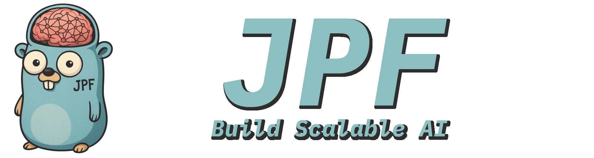

<p align="center">
  
</p>

[](https://goreportcard.com/report/github.com/JoshPattman/jpf)
[](https://pkg.go.dev/github.com/JoshPattman/jpf)
[](https://opensource.org/licenses/MIT)

Providing essential building blocks and robust LLM interaction interfaces, **jpf** enables you to craft custom AI solutions without the bloat.

## Features

- **Retry and Feedback Handling**: Resilient mechanisms for retrying tasks and incorporating feedback into interactions.
- **Customizable Models**: Seamlessly integrate LLMs from multiple providers using unified interfaces.
- **Token Usage Tracking**: Stay informed of API token consumption for cost-effective development.
- **Stream Responses**: Keep your users engaged with responses that are streamed back as they are generated.
- **Easy-to-use Caching**: Reduce the calls made to models by composing a caching layer onto an existing model.
- **Out-of-the-box Logging**: Simply add logging messages to your models, helping you track down issues.
- **Industry Standard Context Management**: All potentially slow interfaces support Go's context.Context for timeouts and cancellation.
- **Rate Limit Management**: Compose models together to set local rate limits to prevent API errors.
- **MIT License**: Use the code for anything, anywhere, for free.

## Installation

Install jpf in your Go project via:

```bash
go get github.com/JoshPattman/jpf
```

Learn more about JPF in the [Core Concepts](#core-concepts) section.

## Examples

There are multiple examples available in the [examples](https://github.com/JoshPattman/jpf/examples) directory.

## Core Concepts

- jpf aims to separate the various components of building a robust interaction with an LLM for three main reasons:
  - **Reusability**: Build up a set of components you find useful, and write less repeated code.
  - **Flexibility**: Write code in a way that easily allows you to extend the LLM's capabilities - for example you can add cache to an LLM without changing a single line of business logic.
  - **Testability**: Each component being an atomic piece of logic allows you to unit test and mock each and every piece of logic in isolation.
- Below are the core components you will need to understand to write code with jpf:

<details>
<summary>Model</summary>

- `Model`s are the core component of jpf - they wrap an LLM with some additional logic in a consistent interface.
```go
// Model defines an interface to an LLM.
type Model interface {
	// Responds to a set of input messages.
	Respond(ctx context.Context, messages []Message) (ModelResponse, error)
}

type ModelResponse struct {
	// Extra messages that are not the final response,
	// but were used to build up the final response.
	// For example, reasoning messages.
	AuxiliaryMessages []Message
	// The primary response to the users query.
	// Usually the only response that matters.
	Message Message
	// The usage of making this call.
	// This may be the sum of multiple LLM calls.
	Usage Usage
}

// Message defines a text message to/from an LLM.
type Message struct {
	Role    Role
	Content string
	Images  []ImageAttachment
}
```
- Models are built using composition - you can produce a very powerful model by stacking up multiple less powerful models together.
  - The power with this approach is you can abstract away a lot of the complexity from your client code, allowing it to focus primarily on business logic.

```go
// All model constructors in jpf return the Model interface,
// we can re-use our variable as we build it up.
var model jpf.Model

// Switch, based on a boolean variable, if we should use Gemini or OpenAI.
// If using Gemini, we will scale the temperature down a bit (NOT useful - just for demonstration).
if useGemini {
    model = jpf.NewGeminiModel(apiKey, modelName, jpf.WithTemperature{X: temperature*0.8})
} else {
    model = jpf.NewOpenAIModel(apiKey, modelName, jpf.WithTemperature{X: temperature})
}

// Add retrying on API failures to the model.
// This will retry calling the child model multiple times upon an error.
if retries > 0 {
    model = jpf.NewRetryModel(model, retries, jpf.WithDelay{X: time.Second})
}

// Add cache to the model.
// This will skip calling out to the model if the same messages are requested a second time.
if cache != nil {
    model = jpf.NewCachedModel(model, cache)
}

// We now have a model that may/may not be gemini / openai, with retrying and cache.
// However, the client code does not need to know about any of this - to it we are still just calling a model!
```

- Note that even though models can stream back text, it is only intended as a temporary and unreliable way to distract users while waiting for requests.
	- You should always aim to make your code work without streaming, and add it in as an add-in later on to improve the UX - this is more robust.

</details>

<details>
<summary>Encoder</summary>

- An `Encoder` provides an interface to take a specific typed object and produce some messages for the LLM.
  - It does not actually make a call to the `Model`, and it does not decode the response.

```go
// Encoder encodes a structured piece of data into a set of messages for an LLM.
type Encoder[T any] interface {
	BuildInputMessages(T) ([]Message, error)
}
```

- For more complex tasks, you may choose to implement this yourself, however there are some useful encoders built in.

</details>

<details>
<summary>Parser</summary>

- A `Parser` parses the output of an LLM into structured data.
- As with encoders, they do not make any LLM calls.
```go
// Parser converts the LLM response into a structured piece of output data.
// When the LLM response is invalid, it should return [ErrInvalidResponse] (or an error joined on that).
type Parser[U any] interface {
	ParseResponseText(string) (U, error)
}
```
 - You may choose to implement your own parser, however in my experience a JSON object is usually sufficient output.
- When an error in response format is detected, the response decoder must return an error that, at some point in its chain, is an `ErrInvalidResponse` (this will be explained in the pipeline section).

</details>

<details>
<summary>Validator</summary>

- A `Validator` checks the parsed output of an LLM against the input to validate it.
- These are optional in all pipelines (can be passed as nil if no further validation is required).
```go
// Validator takes a parsed LLM response and validates it against the input.
// When the LLM response is invalid, it should return [ErrInvalidResponse] (or an error joined on that).
type Validator[T, U any] interface {
	ValidateParsedResponse(T, U) error
}
```
 - There are no implementations of this in jpf due to how usage-specific the validation would be - you should impolement your own.
- As with the above, validation errors should return an `ErrInvalidResponse`.

</details>

<details>
<summary>Pipeline</summary>

- A `Pipeline` is a collection of a `Encoder`, `Parser`, `Validator` (optional), `Model`, and some additional logic.
- Your business logic should only ever be interacting with LLMs through a pipeline.
- It is a very generic interface, but it is intended to only ever be used for LLM-based functionality.
```go
// Pipeline transforms input of type T into output of type U using an LLM.
// It handles the encoding of input, interaction with the LLM, and decoding of output.
type Pipeline[T, U any] interface {
	Call(context.Context, T) (U, Usage, error)
}
```

- It is not really expected that users will implement their own pipelines, but that is absolutely possible.
- jpf ships with three built-in pipelines:
	- `NewOneShotPipeline`: No retries on validation fails, return errors immediately.
	- `NewFeedbackPipeline`: On `ErrInvalidResponse`, add the error to the conversation and try again.
	- `NewFallbackPipeline`: On `ErrInvalidResponse`, try again with the next model option.
- Notice in the above, we have introduced a second place for retries to occur - this is intentional.
  - API-level errors should be retried at the `Model` level - these are errors that are not the fault of the LLM.
  - LLM response errors should be retried at the `Pipeline` level - these are errors where the LLM has responded with an invalid response, and we would like to tell it what it did wrong and ask again.
- However, if you choose not to use these higher-level retries, you can simply use the one-shot pipeline.

</details>

## FAQ
- I want to change my model's temperature/structured output/output tokens/... after I have built it!
	- The intention is to provide functions that need to use an LLM with a builder function instead of a built object. This way, you can use the builder function multiple times with different parameters.
	- Take a look at the examples to see this concept.
	- This design decision was made as it prevents you from injecting unnecessary LLM-related data into business logic.
- Where are the agents?
	- Agents are built on top of LLMs, but this package is designed for LLM handling, so it lives at the level below agents.
	- Take a look at [JChat](https://github.com/JoshPattman/agent/cmd/jchat) or [react](https://github.com/JoshPattman/react) to see how you can build an agent on top of JPF.
- Why does this not support MCP tools on the OpenAI API / Tool calling / Other advanced API features?
	- Relying on API features like tool calling, MCP tools, or vector stores is not ideal for two reasons: (a) it makes it harder to move between API/model providers (b) it gives you less flexibility and control.
	- These features are not particularly hard to add locally, so you should aim to do so to ensure your application is as robust as possible to API change.

## Author

Developed by Josh Pattman. Learn more at [GitHub](https://github.com/JoshPattman/jpf).
