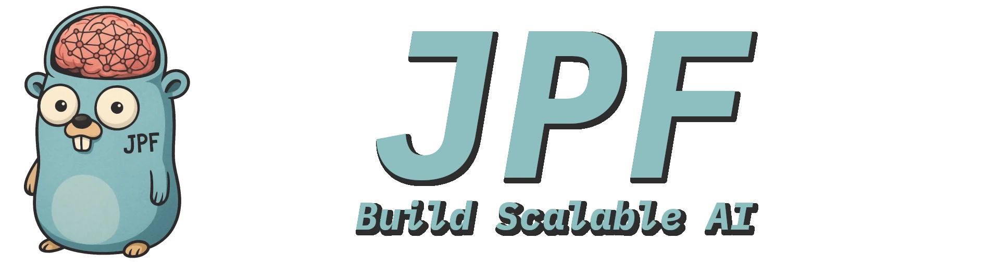

<p align="center">
  
</p>

[](https://pkg.go.dev/github.com/JoshPattman/jpf)
[](https://opensource.org/licenses/MIT)
[](https://github.com/JoshPattman/jpf/actions/workflows/ci.yml)
[](https://github.com/JoshPattman/jpf/actions/workflows/integration.yml)

Providing essential building blocks and robust LLM interaction interfaces, **jpf** enables you to craft custom AI solutions without the bloat.

## Features

- **Retry and Feedback Handling**: Resilient mechanisms for retrying tasks and incorporating feedback into interactions.
- **Customizable Models**: Seamlessly integrate LLMs from multiple providers using unified interfaces — OpenAI (Chat Completions or Responses API) and Google Gemini are supported out of the box.
- **Token Usage Tracking**: Stay informed of API token consumption for cost-effective development.
- **Stream Responses**: Keep your users engaged with responses that are streamed back as they are generated.
- **Easy-to-use Caching**: Reduce the calls made to models by composing a caching layer onto an existing model.
- **Out-of-the-box Logging**: Simply add logging messages to your models, helping you track down issues.
- **Industry Standard Context Management**: All potentially slow interfaces support Go's context.Context for timeouts and cancellation.
- **Rate Limit Management**: Compose models together to set local rate limits to prevent API errors.
- **Tool / Function calling**: Let your models call tools with static or streamed requests.
- **Agent Framework**: Compose a ReAct-style agent on top of any model, complete with tool calling, skills, deferred (async) tool execution, and JSON-serialisable sessions for saving / resuming across process boundaries.
- **MIT License**: Use the code for anything, anywhere, for free.

## Installation

Install jpf in your Go project via:

```bash
go get github.com/JoshPattman/jpf
```

Learn more about JPF in the [Quickstart](#quickstart) section.

## Quickstart

There are multiple examples available in the [examples](https://github.com/JoshPattman/jpf/tree/main/examples) directory.

### Build a model
- A model is capable of responding to a set of messages, and are the core engine behind all of your AI features.
- Models are built through composition, adding functionality that runs on your machine.

```go
func BuildModel() jpf.Model {
	// Create a new gpt-4o model attached to the OpenAI API.
	model := models.NewRemote(
		models.OpenAIChatCompletions, // Defines the API format and the default URL (URL can be overriden) - also supports models.OpenAIResponses and models.Google
		"gpt-4o", // Model name on API
		os.Getenv("OPENAI_KEY"), // API key
		models.WithTemperature(0.5) // Optional params - many more are supported
	)
	// Locally rate limit the model calls to 1 every 5 seconds
	model = models.RateLimit(model, rate.NewLimiter(rate.Every(time.Second*5), 1))
	// Make the model retry non-200 requests up to 5 times
	model = models.Retry(model, 5)
	// Cache model requests in memory - file and database are also supported
	cache := caches.NewRAM()
	model = models.Cache(model, cache)
	return model
}
```

### Build a pipeline
- A pipeline is a wrapper around a model that takes and returns structured data.
- Pipelines may retry using various strategies when a validation error (attempting to parse the output) occurs.
- Pipelines are particularly useful when making one / a few calls to an LLM to perform a fixed task, for example:
	- Translate some text
	- Answer a question about some text
	- Summarise a document

```go
// Define the structured data to provide to the pipeline
type TaskInput struct {
	Name string
}
// Define the structured data to read from the pipeline
type TaskOutput struct {
	IsCelebrity bool `json:"is_celebrity"`
}

// Define a custom validator that will not accpet that santa is not a celebrity
type CustomValidator struct{}

func (c *CustomValidator) ValidateParsedResponse(in TaskInput, out TaskOutput) error {
	if strings.ToLower(in.Name) == "santa" && !out.IsCelebrity {
		return errors.New("santa is a celebrity")
	}
	return nil
}

func BuildPipeline(model jpf.Model) jpf.Pipeline[TaskInput, TaskOutput] {
	// Encode the data to system/user prompt pair, where both are a text/template
	encoder := encoders.NewTemplate[TaskInput]("The user will give you a name. Respond with a json object with a single key, 'is_celebrity'.", "{{ .Name }}")
	// Parse the output message into a struct using json
	parser := parsers.NewJson[TaskOutput]()
	// Only provide the text between { and } to the json parser - cut off extra stuff like backticks
	parser = parsers.SubstringJsonObject(parser)
	// When retrying, will provide fedback by simply formatting the error
	feedback := feedbacks.NewErrString()
	// Create a pipeline that retries up to 5 times on parsing or validation errors
	return pipelines.NewFeedbackRetry(
		encoder,
		parser,
		feedback,
		model,
		5,
		pipelines.WithValidator(&CustomValidator{}), // Optional - omit if no further validation is required
	)
}
```

### Use the pipeline
```go
func IsCelebrity(name string) (bool, error) {
	// Realistically in production code, you would not build the models here,
	// instead you would inject them (or at least inject the builders),
	// as this allows for higher testability and customisability.
	model := BuildModel()
	pipeline := BuildPipeline(model)
	// Calling a pipeline gives a result (with the parsed value and usage), and an error
	resp, err := pipeline.Call(context.Background(), TaskInput{name})
	if err != nil {
		return false, err
	}
	fmt.Println(resp.Usage)
	return resp.Result.IsCelebrity, nil
}
```

### Build an agent
- An agent wraps a model in a ReAct loop, calling tools across multiple turns until it decides it is done.
- Give it a `[]agents.Tool`, each with a `jpf.ToolSchema` describing it to the model, and a `Call` that runs it.
- Leaving a tool's `Call` as `nil` defers it instead of running it inline - the agent pauses and hands you back the pending calls (via `agent.CurrentDeferredToolCalls()`) to resolve however you like (e.g. a background job), then you `Resume` it with the results. See the [deferred-agent example](examples/deferred-agent) for a full save / resume flow.
- An agent's session (prompts, message history, active skills, pending deferred calls) can be round-tripped through JSON with `agents.AgentSessionDTO`, so an agent can be persisted and picked back up by a different process.
- Skills (`agent.SetSkillCatalogue`) are optional blocks of context an agent can activate / deactivate for itself via built-in tools, so you can offer it extra guidance without bloating every request with all of it up front.

```go
func BuildAgent(model jpf.Model) *agents.Agent {
	agent := agents.NewAgent(model)
	agent.SetToolCatalogue([]agents.Tool{
		{
			Schema: jpf.ToolSchema{
				Name:        "ping_user",
				Description: "Ping the user, only use when asked to ping",
				Args:        nil,
			},
			Call: func(_ context.Context, m map[string]any) (string, error) {
				fmt.Println("PING")
				return "the user has been pinged", nil
			},
		},
	})
	return agent
}
```

### Run the agent
```go
func RunAgent(agent *agents.Agent) {
	// Run drives the agent until it stops calling tools, hits its iteration
	// limit, or defers a tool call. The callback is fired for every message
	// added to the conversation along the way.
	err := agent.Run(
		context.Background(),
		"Ping me",
		func(m jpf.Message) { fmt.Printf("%v\n", m) },
	)
	if err != nil {
		panic(err)
	}
}
```

## FAQ
- I want to change my model's temperature/structured output/output tokens/... after I have built it!
	- The intention is to provide functions that need to use an LLM with a builder function instead of a built object. This way, you can use the builder function multiple times with different parameters.
	- Take a look at the examples to see this concept.
	- This design decision was made as it prevents you from injecting unnecessary LLM-related data into business logic.
- Why does this not support MCP tools on the OpenAI API / Other advanced API features?
	- Relying on API features like MCP tools (and full API agents), or vector stores is not ideal for two reasons: (a) it makes it harder to move between API/model providers (b) it gives you less flexibility and control.
	- These features are not particularly hard to add locally, so you should aim to do so to ensure your application is as robust as possible to API change.
	- If a way to abstract the advanced feature such that it becomes provider-agnostic is found, adding it into JPF will be considered.

## Author

Developed by Josh Pattman. Learn more at [GitHub](https://github.com/JoshPattman/jpf).
